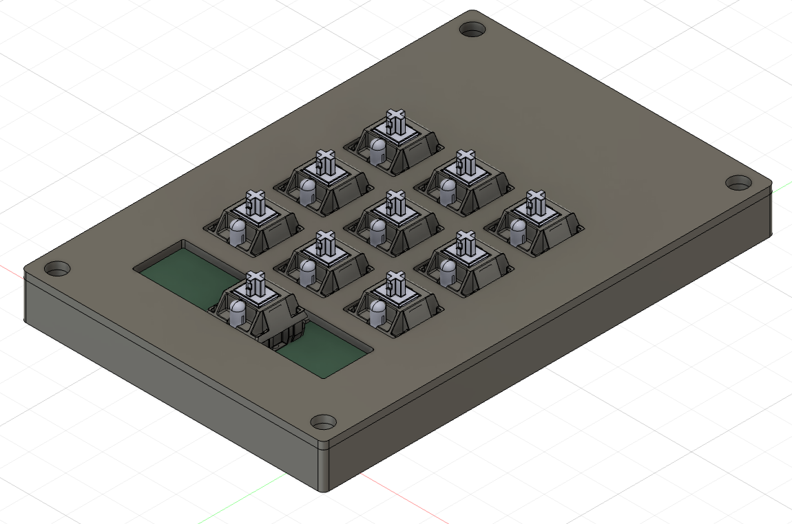
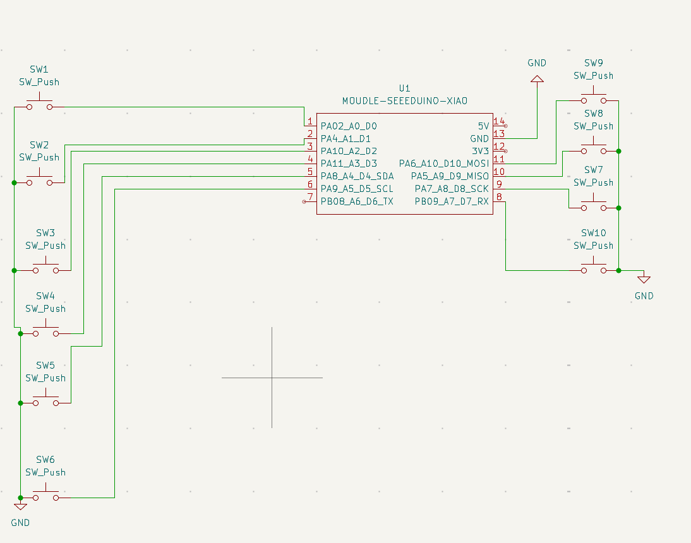
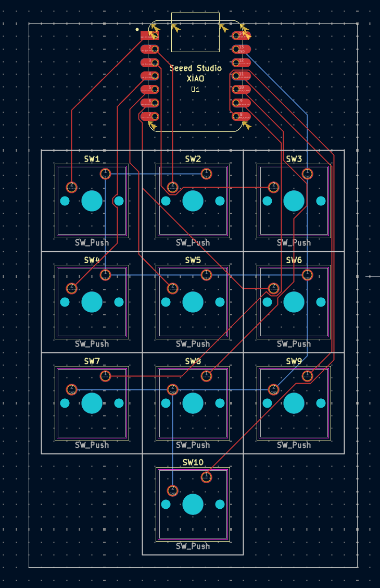

# Ronan's First Macropad

### Inspiration

I Wanted to Do a simple project that would teach me the basics of pcb design and KiCAD. I also wanted a macropad to help me improve my designing workflow

### Challenges

This was my first time using KiCad or any PCB software. I also was unfamiliar with autodesk fusion as I mainly use blender. It still fells a little complicated, but is getting easier as I work more

### Specifications

BOM: 
- 10x Cherry MX Switches
- 1x XIAO RP2040
- 10x Blank DSA Keycaps
- 4x M3x16 Bolt
- 4x M3 Heatset

Schematic            |  PCB         |   Case
:-------------------------:|:-------------------------:|:-------------------------:|
    |    | 

